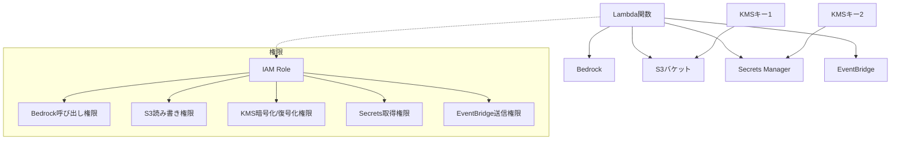

# 設計書 - AWS IAM 検証環境（Complex）

## 概要

最も複雑な AWS 環境として、Lambda 関数が Bedrock、KMS 暗号化された S3、Secrets Manager、EventBridge を統合利用する構成を実装します。CDK v2 と TypeScript を使用し、複雑なサービス間依存関係と暗黙的な KMS 権限を含む高度な権限付与を行います。

## アーキテクチャ



### 主要コンポーネント

- **Lambda 関数**: Node.js 22.x、AWS SDK v3 使用、AI 処理統合
- **Bedrock**: Claude/Titan モデルでテキスト処理
- **S3 バケット**: カスタマーマネージド KMS 暗号化
- **Secrets Manager**: 外部 webhook URL、別 KMS 暗号化
- **EventBridge**: カスタムイベントバス
- **KMS キー**: S3 用と Secrets 用の 2 つ
- **IAM ロール**: CDK の grant メソッドで複雑な権限マトリックス生成

## コンポーネントと インターフェース

### Lambda 関数

```typescript
// メインハンドラーのインターフェース
export const handler = async (event: any): Promise<any> => {
  // 1. Secrets Managerからwebhook URL取得
  // 2. Bedrockでテキスト処理
  // 3. 結果をS3に保存（KMS暗号化）
  // 4. EventBridgeにイベント送信
  // 5. エラーハンドリング
};

interface ProcessingResult {
  inputText: string;
  bedrockResponse: string;
  s3Location: string;
  eventId: string;
  webhookUrl: string;
  timestamp: string;
}
```

**主要な依存関係:**

- `@aws-sdk/client-bedrock-runtime`: Bedrock 操作用
- `@aws-sdk/client-s3`: S3 操作用
- `@aws-sdk/client-secrets-manager`: Secrets Manager 操作用
- `@aws-sdk/client-eventbridge`: EventBridge 操作用
- AWS Lambda Runtime: Node.js 22.x

### Bedrock 統合

```typescript
// Bedrockクライアント設定
const bedrockClient = new BedrockRuntimeClient({ region: "us-east-1" });

interface BedrockRequest {
  modelId: string; // 'anthropic.claude-3-sonnet-20240229-v1:0'
  contentType: string;
  accept: string;
  body: string;
}
```

**設定:**

- モデル: Claude 3 Sonnet
- リージョン: us-east-1（Bedrock 利用可能）
- 入力: テキストプロンプト
- 出力: AI 生成レスポンス

### KMS 暗号化 S3 バケット

```typescript
// CDKでのS3とKMS設定
const s3KmsKey = new kms.Key(this, "S3EncryptionKey", {
  description: "S3バケット暗号化用KMSキー",
  enableKeyRotation: true,
});

const bucket = new s3.Bucket(this, "ComplexTestBucket", {
  encryptionKey: s3KmsKey,
  encryption: s3.BucketEncryption.KMS,
  removalPolicy: RemovalPolicy.DESTROY, // 検証用
});
```

**設定:**

- 暗号化: カスタマーマネージド KMS
- キーローテーション: 有効
- アクセス: Lambda 関数のみ（暗黙的 KMS 権限含む）

### Secrets Manager 統合

```typescript
// CDKでのSecrets Manager設定
const secretsKmsKey = new kms.Key(this, "SecretsEncryptionKey", {
  description: "Secrets Manager暗号化用KMSキー",
  enableKeyRotation: true,
});

const webhookSecret = new secretsmanager.Secret(this, "WebhookSecret", {
  description: "外部通知用Webhook URL",
  encryptionKey: secretsKmsKey,
  generateSecretString: {
    secretStringTemplate: JSON.stringify({ webhookUrl: "" }),
    generateStringKey: "webhookUrl",
    excludeCharacters: '"@/\\',
  },
});
```

**設定:**

- 暗号化: 別のカスタマーマネージド KMS
- 内容: ダミー webhook URL
- アクセス: Lambda 関数のみ（暗黙的 KMS 権限含む）

### EventBridge カスタムバス

```typescript
// CDKでのEventBridge設定
const customEventBus = new events.EventBus(this, "ComplexTestEventBus", {
  eventBusName: "complex-iam-test-bus",
});

interface CustomEvent {
  Source: string;
  DetailType: string;
  Detail: {
    processingResult: ProcessingResult;
    status: "success" | "error";
    metadata: Record<string, any>;
  };
}
```

### CDK スタック構成

```typescript
export class ComplexIamTestStack extends Stack {
  constructor(scope: Construct, id: string, props?: StackProps) {
    // KMSキー2つの作成
    // S3バケット（KMS暗号化）の作成
    // Secrets Manager（KMS暗号化）の作成
    // EventBridgeカスタムバスの作成
    // Lambda関数の作成
    // 複雑な権限付与（複数grantメソッド）
    // 環境変数の設定
  }
}
```

## データモデル

### Bedrock リクエスト/レスポンス

```json
// リクエスト
{
  "anthropic_version": "bedrock-2023-05-31",
  "max_tokens": 1000,
  "messages": [
    {
      "role": "user",
      "content": "入力テキストを要約してください: {inputText}"
    }
  ]
}

// レスポンス
{
  "content": [
    {
      "type": "text",
      "text": "要約されたテキスト内容"
    }
  ],
  "usage": {
    "input_tokens": 100,
    "output_tokens": 50
  }
}
```

### S3 保存データ

```json
{
  "processingId": "uuid-v4",
  "timestamp": "2024-12-23T10:00:00.000Z",
  "input": {
    "originalText": "処理対象のテキスト",
    "source": "lambda-invocation"
  },
  "bedrock": {
    "modelId": "anthropic.claude-3-sonnet-20240229-v1:0",
    "response": "AI生成の要約テキスト",
    "usage": {
      "inputTokens": 100,
      "outputTokens": 50
    }
  },
  "webhook": {
    "url": "https://example.com/webhook",
    "retrieved": true
  }
}
```

### EventBridge イベント

```json
{
  "Source": "complex-iam-test",
  "DetailType": "AI Processing Completed",
  "Detail": {
    "processingResult": {
      "inputText": "元のテキスト",
      "bedrockResponse": "AI処理結果",
      "s3Location": "s3://bucket/key",
      "eventId": "uuid-v4",
      "webhookUrl": "https://example.com/webhook",
      "timestamp": "2024-12-23T10:00:00.000Z"
    },
    "status": "success",
    "metadata": {
      "executionTime": 2500,
      "region": "ap-northeast-1"
    }
  }
}
```

## 正確性プロパティ

_プロパティは、システムのすべての有効な実行において真であるべき特性や動作です。これらは人間が読める仕様と機械で検証可能な正確性保証の橋渡しとなります。_

### プロパティ 1: エンドツーエンド処理の完全性

*任意の*有効な入力テキストに対して、Lambda 関数は Bedrock 処理、S3 保存、EventBridge 送信のすべてを正常に完了する
**検証対象: 要件 1.4, 6.5**

### プロパティ 2: KMS 暗号化の透明性

*任意の*S3 および Secrets Manager 操作に対して、KMS 暗号化/復号化は透明に動作し、Lambda 関数は暗黙的権限で正常にアクセスできる
**検証対象: 要件 2.4, 2.5, 3.3, 3.4**

### プロパティ 3: シークレット取得の安全性

*任意の*Secrets Manager 呼び出しに対して、Lambda 関数は暗号化されたシークレットを正常に取得し、処理で使用できる
**検証対象: 要件 3.3, 3.4**

### プロパティ 4: イベント送信の確実性

*任意の*処理完了時に対して、Lambda 関数はカスタム EventBridge バスに適切な形式のイベントを送信する
**検証対象: 要件 4.2, 4.3**

### プロパティ 5: 権限マトリックスの最小化

*任意の*CDK 生成 IAM ポリシーに対して、Lambda 関数は 5 つのサービス（Bedrock、S3、KMS、Secrets Manager、EventBridge）の必要最小限の権限のみを持つ
**検証対象: 要件 5.3, 7.1, 7.2**

### プロパティ 6: エラー時の部分実行防止

*任意の*処理エラーが発生した場合に対して、Lambda 関数は適切にロールバックし、不整合な状態を残さない
**検証対象: 要件 1.5, 6.3**

## エラーハンドリング

### Bedrock 関連エラー

- **ThrottlingException**: API 呼び出し制限超過
- **ValidationException**: 無効なリクエスト形式
- **ModelNotReadyException**: モデルが利用不可
- **AccessDeniedException**: Bedrock 権限不足

### KMS 関連エラー

- **KMSKeyDisabledException**: KMS キーが無効
- **KMSAccessDeniedException**: KMS 権限不足
- **KMSInvalidStateException**: KMS キー状態異常

### 統合エラーハンドリング

```typescript
export const handler = async (event: any): Promise<any> => {
  const processingId = generateUUID();
  let webhookUrl: string;
  let bedrockResponse: string;
  let s3Location: string;

  try {
    // 1. Secrets取得（KMS復号化含む）
    webhookUrl = await getWebhookUrl();

    // 2. Bedrock処理
    bedrockResponse = await processWithBedrock(event.inputText);

    // 3. S3保存（KMS暗号化含む）
    s3Location = await saveToS3(processingId, {
      input: event.inputText,
      bedrock: bedrockResponse,
      webhook: webhookUrl,
    });

    // 4. EventBridge送信
    await sendProcessingEvent({
      processingId,
      status: "success",
      s3Location,
      bedrockResponse,
    });

    return { statusCode: 200, processingId };
  } catch (error) {
    console.error("処理エラー:", error);

    // エラーイベント送信
    await sendProcessingEvent({
      processingId,
      status: "error",
      error: error.message,
    });

    throw error;
  }
};
```

## テスト戦略

### 二重テストアプローチ

- **ユニットテスト**: 特定の例、エッジケース、エラー条件を検証
- **プロパティテスト**: すべての入力にわたる汎用プロパティを検証
- 両方が補完的で包括的なカバレッジに必要

### ユニットテスト

- 各サービス統合の個別テスト
- エラーハンドリングの特定ケース
- KMS 暗号化/復号化の動作確認
- CDK スタックの複雑なリソース作成テスト

### プロパティベーステスト

- 最小 100 回の反復実行
- 各プロパティテストは設計書のプロパティを参照
- タグ形式: **Feature: aws-iam-autopilot-complex, Property {番号}: {プロパティテキスト}**

### テストライブラリ

- **Jest**: ユニットテスト用
- **fast-check**: プロパティベーステスト用（TypeScript）
- **AWS CDK Testing**: CDK スタックテスト用
- **AWS SDK Mocks**: サービス統合テスト用

### テスト設定

```typescript
// プロパティテストの例
fc.assert(
  fc.property(
    fc.string(1, 1000), // ランダムな入力テキスト
    async (inputText) => {
      // Lambda関数の呼び出し
      // 全サービス統合の検証
      // エンドツーエンド処理の確認
    }
  ),
  { numRuns: 100 }
);
```

### モックとスタブ

```typescript
// Bedrockモック
jest.mock("@aws-sdk/client-bedrock-runtime");
const mockBedrock = BedrockRuntimeClient as jest.MockedClass<
  typeof BedrockRuntimeClient
>;

// 統合テスト用の実際のAWSサービス呼び出し
// ローカル環境ではLocalStackを使用
```
