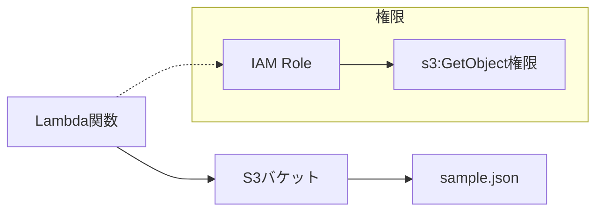
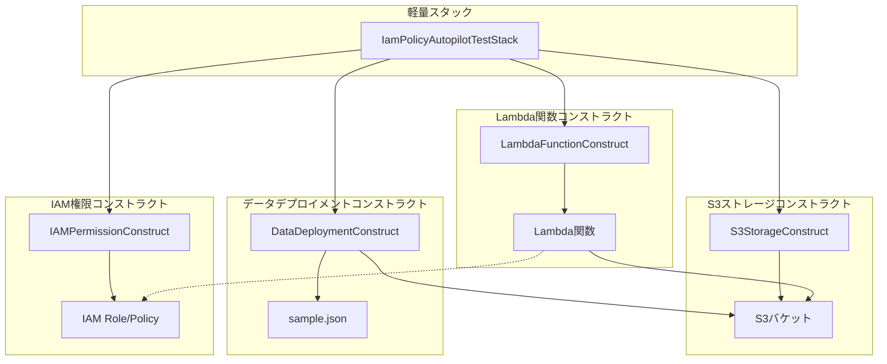

# 設計書 - AWS IAM 検証環境（Simple）

## 概要

最もシンプルな AWS 環境として、Lambda 関数が S3 バケットから JSON ファイルを読み込む構成を実装します。CDK v2 と TypeScript を使用し、**全てのコンポーネントを再利用可能なコンストラクトとして分割実装**し、標準的な grant メソッドによる権限付与を行います。

## アーキテクチャ

### 従来のモノリシック構成



### 新しいコンストラクト分割構成



### 主要コンポーネント

- **S3StorageConstruct**: S3 バケット作成と設定管理
- **DataDeploymentConstruct**: ファイルデプロイメント管理
- **LambdaFunctionConstruct**: Lambda 関数作成と設定管理
- **IAMPermissionConstruct**: IAM 権限設定管理
- **軽量スタック**: コンストラクトの組み合わせのみ

## コンポーネントと インターフェース

### S3StorageConstruct

**責任**: S3 バケットの作成と基本設定の管理

```typescript
interface S3StorageConstructProps {
  bucketName?: string;
  encryption?: s3.BucketEncryption;
  removalPolicy?: cdk.RemovalPolicy;
  blockPublicAccess?: s3.BlockPublicAccess;
}

export class S3StorageConstruct extends Construct {
  public readonly bucket: s3.Bucket;

  constructor(scope: Construct, id: string, props?: S3StorageConstructProps) {
    // S3バケットの作成と設定
  }
}
```

### DataDeploymentConstruct

**責任**: ローカルファイルの S3 バケットへのデプロイメント管理

```typescript
interface DataDeploymentConstructProps {
  targetBucket: s3.IBucket;
  sourcePath: string;
  destinationKeyPrefix?: string;
  prune?: boolean;
}

export class DataDeploymentConstruct extends Construct {
  public readonly deployment: s3deploy.BucketDeployment;

  constructor(
    scope: Construct,
    id: string,
    props: DataDeploymentConstructProps
  ) {
    // ファイルデプロイメントの設定
  }
}
```

### LambdaFunctionConstruct

**責任**: Lambda 関数の作成と基本設定の管理

```typescript
interface LambdaFunctionConstructProps {
  functionName?: string;
  runtime?: lambda.Runtime;
  handler?: string;
  code: lambda.Code;
  environment?: { [key: string]: string };
  timeout?: cdk.Duration;
  memorySize?: number;
}

export class LambdaFunctionConstruct extends Construct {
  public readonly function: lambda.Function;

  constructor(
    scope: Construct,
    id: string,
    props: LambdaFunctionConstructProps
  ) {
    // Lambda関数の作成と設定
  }
}
```

### IAMPermissionConstruct

**責任**: Lambda 関数と S3 バケット間の IAM 権限設定の管理

```typescript
interface IAMPermissionConstructProps {
  lambdaFunction: lambda.IFunction;
  s3Bucket: s3.IBucket;
  permissions?: ("read" | "write" | "delete")[];
}

export class IAMPermissionConstruct extends Construct {
  constructor(
    scope: Construct,
    id: string,
    props: IAMPermissionConstructProps
  ) {
    // IAM権限の設定
  }
}
```

### 軽量スタック構成

```typescript
export class IamPolicyAutopilotTestStack extends Stack {
  constructor(scope: Construct, id: string, props?: StackProps) {
    super(scope, id, props);

    // コンストラクトのインスタンス化のみ
    const s3Storage = new S3StorageConstruct(this, "S3Storage", {
      encryption: s3.BucketEncryption.S3_MANAGED,
      removalPolicy: RemovalPolicy.DESTROY,
    });

    const dataDeployment = new DataDeploymentConstruct(this, "DataDeployment", {
      targetBucket: s3Storage.bucket,
      sourcePath: "assets",
      prune: true,
    });

    const lambdaFunction = new LambdaFunctionConstruct(this, "LambdaFunction", {
      runtime: lambda.Runtime.NODEJS_22_X,
      handler: "index.handler",
      code: lambda.Code.fromAsset("lambda/simple-s3-reader"),
      environment: {
        BUCKET_NAME: s3Storage.bucket.bucketName,
      },
    });

    const iamPermission = new IAMPermissionConstruct(this, "IAMPermission", {
      lambdaFunction: lambdaFunction.function,
      s3Bucket: s3Storage.bucket,
      permissions: ["read"],
    });
  }
}
```

## データモデル

### サンプル JSON ファイル

```json
{
  "message": "Hello from S3!",
  "timestamp": "2024-12-23T10:00:00Z",
  "environment": "simple-test",
  "data": {
    "key1": "value1",
    "key2": "value2"
  }
}
```

### Lambda レスポンス

```typescript
interface LambdaResponse {
  statusCode: number;
  body: string;
  headers?: Record<string, string>;
}
```

## 正確性プロパティ

_プロパティは、システムのすべての有効な実行において真であるべき特性や動作です。これらは人間が読める仕様と機械で検証可能な正確性保証の橋渡しとなります。_

### プロパティ 1: S3 ファイル読み込み成功

*任意の*有効な S3 バケットと JSON ファイルに対して、Lambda 関数は正常にファイル内容を読み込み、コンソールに出力できる
**検証対象: 要件 1.3, 1.4**

### プロパティ 2: エラーハンドリング

*任意の*存在しないファイルまたは無効な S3 パスに対して、Lambda 関数は適切なエラーメッセージをログに記録し、正常に終了する
**検証対象: 要件 1.5**

### プロパティ 3: 権限の最小化

*任意の*CDK 生成 IAM ポリシーに対して、Lambda 関数は必要最小限の S3 読み取り権限のみを持つ
**検証対象: 要件 2.4, 3.3**

### プロパティ 4: コンストラクト独立性

*任意の*コンストラクトに対して、必要な依存関係が提供されれば、他のコンストラクトの存在に関係なく正常に動作する
**検証対象: 要件 6.1, 6.2, 6.3, 6.4**

### プロパティ 5: スタック軽量化

*任意の*スタック定義に対して、スタックはコンストラクトの組み合わせのみを含み、直接的な AWS リソース定義を含まない
**検証対象: 要件 7.1, 7.2**

### プロパティ 6: 依存関係管理

*任意の*コンストラクト間の依存関係に対して、スタックは適切な順序で依存関係を解決し、必要な出力値を公開する
**検証対象: 要件 7.3, 7.4**

## エラーハンドリング

### S3 関連エラー

- **NoSuchKey**: ファイルが存在しない場合
- **AccessDenied**: 権限不足の場合
- **InvalidBucketName**: バケット名が無効な場合

### Lambda 関数でのエラー処理

```typescript
try {
  const response = await s3Client.send(getObjectCommand);
  // 正常処理
} catch (error) {
  if (error.name === "NoSuchKey") {
    console.error("ファイルが見つかりません:", error);
  } else if (error.name === "AccessDenied") {
    console.error("アクセス権限がありません:", error);
  } else {
    console.error("予期しないエラー:", error);
  }
  throw error;
}
```

## テスト戦略

### 二重テストアプローチ

- **ユニットテスト**: 特定の例、エッジケース、エラー条件を検証
- **プロパティテスト**: すべての入力にわたる汎用プロパティを検証
- 両方が補完的で包括的なカバレッジに必要

### ユニットテスト

- Lambda 関数の正常系テスト
- S3 ファイル読み込みの成功ケース
- エラーハンドリングの特定ケース
- CDK スタックのリソース作成テスト

### プロパティベーステスト

- 最小 100 回の反復実行
- 各プロパティテストは設計書のプロパティを参照
- タグ形式: **Feature: aws-iam-autopilot-simple, Property {番号}: {プロパティテキスト}**

### テストライブラリ

- **Jest**: ユニットテスト用
- **fast-check**: プロパティベーステスト用（TypeScript）
- **AWS CDK Testing**: CDK スタックテスト用

### テスト設定

```typescript
// プロパティテストの例
fc.assert(
  fc.property(
    fc.string(), // ランダムなファイル名
    async (fileName) => {
      // Lambda関数の呼び出し
      // 結果の検証
    }
  ),
  { numRuns: 100 }
);
```
