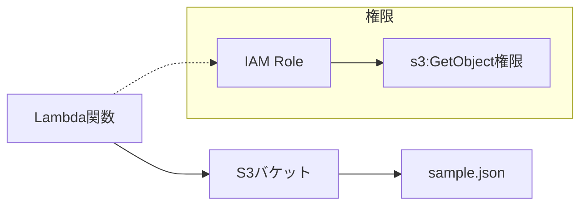

# 設計書 - AWS IAM 検証環境（Simple）

## 概要

最もシンプルな AWS 環境として、Lambda 関数が S3 バケットから JSON ファイルを読み込む構成を実装します。CDK v2 と TypeScript を使用し、標準的な grant メソッドによる権限付与を行います。

## アーキテクチャ



### 主要コンポーネント

- **Lambda 関数**: Node.js 22.x、AWS SDK v3 使用
- **S3 バケット**: デフォルト暗号化（AES256）
- **IAM ロール**: CDK の s3.grantRead()で自動生成

## コンポーネントと インターフェース

### Lambda 関数

```typescript
// ハンドラー関数のインターフェース
export const handler = async (event: any): Promise<any> => {
  // S3からJSONファイルを読み込み
  // 内容をコンソールに出力
  // エラーハンドリング
};
```

**主要な依存関係:**

- `@aws-sdk/client-s3`: S3 操作用
- AWS Lambda Runtime: Node.js 22.x

### S3 バケット

```typescript
// CDKでのS3バケット定義
const bucket = new s3.Bucket(this, "SimpleTestBucket", {
  encryption: s3.BucketEncryption.S3_MANAGED,
  removalPolicy: RemovalPolicy.DESTROY, // 検証用
});
```

**設定:**

- 暗号化: AES256（S3 マネージド）
- アクセス: Lambda 関数のみ
- サンプルファイル: `sample.json`

### CDK スタック構成

```typescript
export class SimpleIamTestStack extends Stack {
  constructor(scope: Construct, id: string, props?: StackProps) {
    // Lambda関数の作成
    // S3バケットの作成
    // 権限付与（s3.grantRead）
    // サンプルファイルのデプロイ
  }
}
```

## データモデル

### サンプル JSON ファイル

```json
{
  "message": "Hello from S3!",
  "timestamp": "2024-12-23T10:00:00Z",
  "environment": "simple-test",
  "data": {
    "key1": "value1",
    "key2": "value2"
  }
}
```

### Lambda レスポンス

```typescript
interface LambdaResponse {
  statusCode: number;
  body: string;
  headers?: Record<string, string>;
}
```

## 正確性プロパティ

_プロパティは、システムのすべての有効な実行において真であるべき特性や動作です。これらは人間が読める仕様と機械で検証可能な正確性保証の橋渡しとなります。_

### プロパティ 1: S3 ファイル読み込み成功

*任意の*有効な S3 バケットと JSON ファイルに対して、Lambda 関数は正常にファイル内容を読み込み、コンソールに出力できる
**検証対象: 要件 1.3, 1.4**

### プロパティ 2: エラーハンドリング

*任意の*存在しないファイルまたは無効な S3 パスに対して、Lambda 関数は適切なエラーメッセージをログに記録し、正常に終了する
**検証対象: 要件 1.5**

### プロパティ 3: 権限の最小化

*任意の*CDK 生成 IAM ポリシーに対して、Lambda 関数は必要最小限の S3 読み取り権限のみを持つ
**検証対象: 要件 2.4, 3.3**

## エラーハンドリング

### S3 関連エラー

- **NoSuchKey**: ファイルが存在しない場合
- **AccessDenied**: 権限不足の場合
- **InvalidBucketName**: バケット名が無効な場合

### Lambda 関数でのエラー処理

```typescript
try {
  const response = await s3Client.send(getObjectCommand);
  // 正常処理
} catch (error) {
  if (error.name === "NoSuchKey") {
    console.error("ファイルが見つかりません:", error);
  } else if (error.name === "AccessDenied") {
    console.error("アクセス権限がありません:", error);
  } else {
    console.error("予期しないエラー:", error);
  }
  throw error;
}
```

## テスト戦略

### 二重テストアプローチ

- **ユニットテスト**: 特定の例、エッジケース、エラー条件を検証
- **プロパティテスト**: すべての入力にわたる汎用プロパティを検証
- 両方が補完的で包括的なカバレッジに必要

### ユニットテスト

- Lambda 関数の正常系テスト
- S3 ファイル読み込みの成功ケース
- エラーハンドリングの特定ケース
- CDK スタックのリソース作成テスト

### プロパティベーステスト

- 最小 100 回の反復実行
- 各プロパティテストは設計書のプロパティを参照
- タグ形式: **Feature: aws-iam-autopilot-simple, Property {番号}: {プロパティテキスト}**

### テストライブラリ

- **Jest**: ユニットテスト用
- **fast-check**: プロパティベーステスト用（TypeScript）
- **AWS CDK Testing**: CDK スタックテスト用

### テスト設定

```typescript
// プロパティテストの例
fc.assert(
  fc.property(
    fc.string(), // ランダムなファイル名
    async (fileName) => {
      // Lambda関数の呼び出し
      // 結果の検証
    }
  ),
  { numRuns: 100 }
);
```
