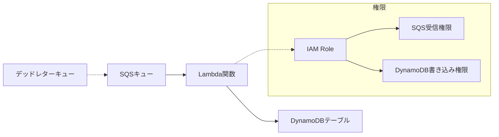

# 設計書 - AWS IAM 検証環境（Standard）

## 概要

中程度の複雑さを持つ AWS 環境として、Lambda 関数が SQS メッセージを受信して DynamoDB に保存する構成を実装します。CDK v2 と TypeScript を使用し、複数サービス間の権限付与を標準的な grant メソッドで行います。

## アーキテクチャ



### 主要コンポーネント

- **SQS キュー**: メッセージ受信、デッドレターキュー付き
- **Lambda 関数**: Node.js 22.x、AWS SDK v3 使用、SQS イベント処理
- **DynamoDB テーブル**: オンデマンド課金、メッセージ保存用
- **IAM ロール**: CDK の grant メソッドで自動生成

## コンポーネントと インターフェース

### Lambda 関数

```typescript
// SQSイベントハンドラーのインターフェース
export const handler = async (event: SQSEvent): Promise<void> => {
  // SQSメッセージの処理
  // DynamoDBへの保存
  // エラーハンドリング
};

interface ProcessedMessage {
  messageId: string;
  body: string;
  timestamp: string;
  sourceQueue: string;
}
```

**主要な依存関係:**

- `@aws-sdk/client-dynamodb`: DynamoDB 操作用
- `@aws-sdk/client-sqs`: SQS 操作用（削除確認）
- AWS Lambda Runtime: Node.js 22.x

### SQS キュー

```typescript
// CDKでのSQS設定
const queue = new sqs.Queue(this, "StandardTestQueue", {
  visibilityTimeout: Duration.seconds(300),
  deadLetterQueue: {
    queue: deadLetterQueue,
    maxReceiveCount: 3,
  },
});

// Lambda関数のイベントソース設定
const eventSource = new SqsEventSource(queue, {
  batchSize: 10,
  maxBatchingWindow: Duration.seconds(5),
});
```

**設定:**

- 可視性タイムアウト: 300 秒
- デッドレターキュー: 3 回失敗後
- バッチサイズ: 10 メッセージ

### DynamoDB テーブル

```typescript
// CDKでのDynamoDB設定
const table = new dynamodb.Table(this, "StandardTestTable", {
  partitionKey: { name: "messageId", type: dynamodb.AttributeType.STRING },
  sortKey: { name: "timestamp", type: dynamodb.AttributeType.STRING },
  billingMode: dynamodb.BillingMode.ON_DEMAND,
  removalPolicy: RemovalPolicy.DESTROY, // 検証用
});
```

**スキーマ:**

- パーティションキー: `messageId` (String)
- ソートキー: `timestamp` (String)
- 属性: `body`, `sourceQueue`, `processedAt`

### CDK スタック構成

```typescript
export class StandardIamTestStack extends Stack {
  constructor(scope: Construct, id: string, props?: StackProps) {
    // DynamoDBテーブルの作成
    // SQSキューとDLQの作成
    // Lambda関数の作成
    // 権限付与（queue.grantConsumeMessages, table.grantWriteData）
    // イベントソースマッピングの設定
  }
}
```

## データモデル

### SQS メッセージ形式

```json
{
  "messageId": "12345678-1234-1234-1234-123456789012",
  "body": "{\"action\":\"process\",\"data\":{\"key\":\"value\"}}",
  "attributes": {
    "SentTimestamp": "1640995200000"
  },
  "messageAttributes": {},
  "md5OfBody": "abc123...",
  "eventSource": "aws:sqs",
  "eventSourceARN": "arn:aws:sqs:region:account:queue-name"
}
```

### DynamoDB アイテム

```json
{
  "messageId": "12345678-1234-1234-1234-123456789012",
  "timestamp": "2024-12-23T10:00:00.000Z",
  "body": "{\"action\":\"process\",\"data\":{\"key\":\"value\"}}",
  "sourceQueue": "StandardTestQueue",
  "processedAt": "2024-12-23T10:00:01.000Z",
  "status": "processed"
}
```

## 正確性プロパティ

_プロパティは、システムのすべての有効な実行において真であるべき特性や動作です。これらは人間が読める仕様と機械で検証可能な正確性保証の橋渡しとなります。_

### プロパティ 1: メッセージ処理の完全性

*任意の*有効な SQS メッセージに対して、Lambda 関数はメッセージを正常に処理し、DynamoDB に保存する
**検証対象: 要件 1.3, 1.4**

### プロパティ 2: バッチ処理の正確性

*任意の*SQS メッセージバッチに対して、すべてのメッセージが個別に処理され、それぞれが DynamoDB に保存される
**検証対象: 要件 1.6**

### プロパティ 3: エラー時のメッセージ保持

*任意の*処理エラーが発生したメッセージに対して、メッセージは SQS に残り、再処理または DLQ に移動される
**検証対象: 要件 1.5, 2.4**

### プロパティ 4: 権限の適切性

*任意の*CDK 生成 IAM ポリシーに対して、Lambda 関数は SQS 受信と DynamoDB 書き込みの必要最小限の権限のみを持つ
**検証対象: 要件 2.5, 3.3, 4.2**

## エラーハンドリング

### SQS 関連エラー

- **MessageNotInflight**: メッセージが既に処理済み
- **ReceiptHandleIsInvalid**: 無効な受信ハンドル
- **QueueDoesNotExist**: キューが存在しない

### DynamoDB 関連エラー

- **ConditionalCheckFailedException**: 条件チェック失敗
- **ProvisionedThroughputExceededException**: スループット超過
- **ResourceNotFoundException**: テーブルが存在しない

### Lambda 関数でのエラー処理

```typescript
export const handler = async (event: SQSEvent): Promise<void> => {
  const failedMessages: string[] = [];

  for (const record of event.Records) {
    try {
      await processMessage(record);
    } catch (error) {
      console.error(`メッセージ処理失敗: ${record.messageId}`, error);
      failedMessages.push(record.messageId);
    }
  }

  if (failedMessages.length > 0) {
    // 部分的な失敗の場合、失敗したメッセージのみ再処理
    throw new Error(`処理失敗メッセージ: ${failedMessages.join(", ")}`);
  }
};
```

## テスト戦略

### 二重テストアプローチ

- **ユニットテスト**: 特定の例、エッジケース、エラー条件を検証
- **プロパティテスト**: すべての入力にわたる汎用プロパティを検証
- 両方が補完的で包括的なカバレッジに必要

### ユニットテスト

- Lambda 関数の正常系テスト（単一メッセージ）
- バッチメッセージ処理テスト
- DynamoDB 書き込み成功ケース
- エラーハンドリングの特定ケース
- CDK スタックのリソース作成テスト

### プロパティベーステスト

- 最小 100 回の反復実行
- 各プロパティテストは設計書のプロパティを参照
- タグ形式: **Feature: aws-iam-autopilot-standard, Property {番号}: {プロパティテキスト}**

### テストライブラリ

- **Jest**: ユニットテスト用
- **fast-check**: プロパティベーステスト用（TypeScript）
- **AWS CDK Testing**: CDK スタックテスト用
- **@aws-sdk/client-dynamodb**: DynamoDB ローカルテスト用

### テスト設定

```typescript
// プロパティテストの例
fc.assert(
  fc.property(
    fc.array(
      fc.record({
        messageId: fc.uuid(),
        body: fc.jsonObject(),
        timestamp: fc.date(),
      })
    ), // ランダムなメッセージバッチ
    async (messages) => {
      // Lambda関数の呼び出し
      // DynamoDB保存の検証
      // メッセージ数の一致確認
    }
  ),
  { numRuns: 100 }
);
```
